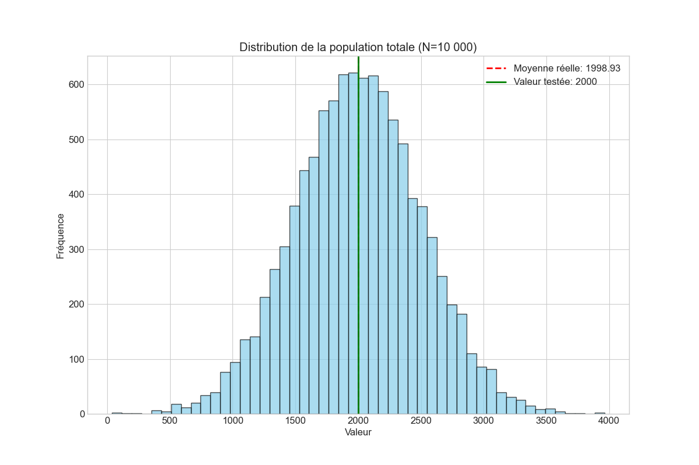
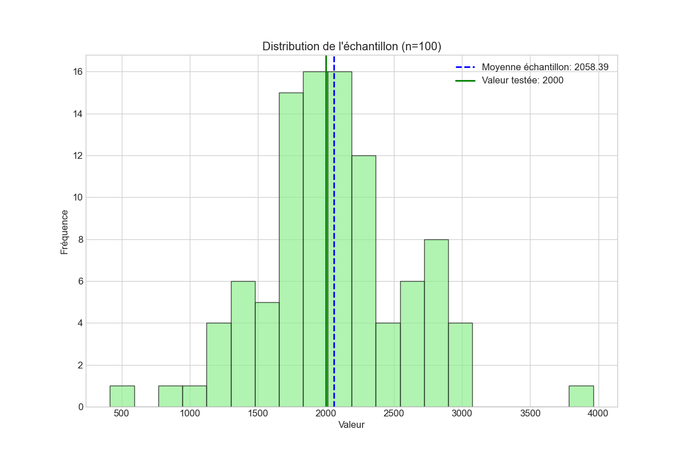
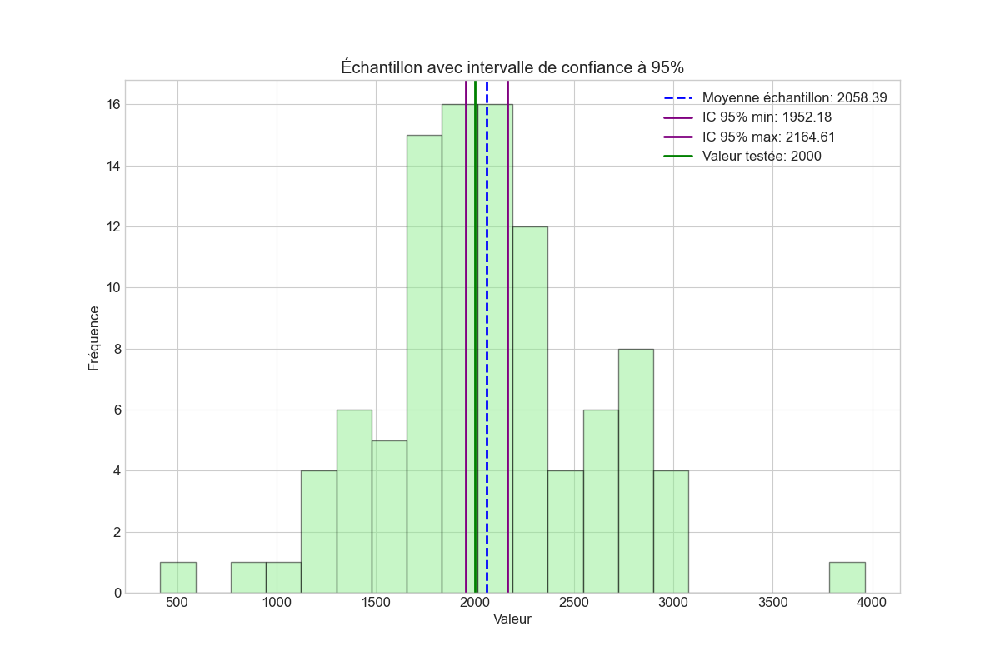
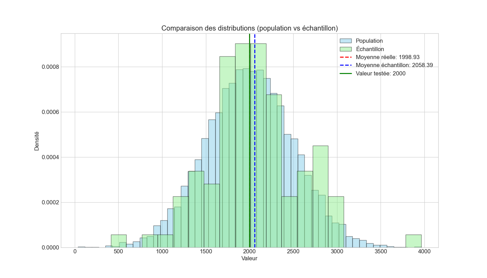

# Analyse Statistique par Échantillonnage

## Visualisations

<div align="center">
  <table>
    <tr>
      <td></td>
      <td></td>
    </tr>
    <tr>
      <td></td>
      <td></td>
    </tr>
  </table>
</div>

Ce projet illustre les concepts fondamentaux de statistique: échantillonnage, estimation, intervalle de confiance et test d'hypothèse.

## Description

Le script `analyse_statistique.py` simule une population de 10 000 individus avec une distribution normale, puis:
- Extrait un échantillon aléatoire de 100 individus
- Calcule la moyenne et l'écart-type de l'échantillon
- Détermine un intervalle de confiance à 95%
- Effectue un test d'hypothèse (t-test) pour comparer la moyenne à une valeur de référence
- Génère des visualisations pour illustrer les résultats

## Prérequis

Pour exécuter ce script, vous aurez besoin de:
- Python 3.6 ou supérieur
- Les bibliothèques suivantes:
  - NumPy
  - Matplotlib
  - SciPy

## Installation des dépendances

```bash
pip install -r requirements.txt
```

## Utilisation

Pour exécuter l'analyse:

```bash
python analyse_statistique.py
```

## Résultats

Le script génère:
1. Des statistiques affichées dans la console:
   - Paramètres réels de la population
   - Statistiques de l'échantillon
   - Intervalle de confiance à 95%
   - Résultats du test d'hypothèse

2. Quatre visualisations enregistrées en format PNG:
   - `population_totale.png`: Distribution de la population complète
   - `echantillon.png`: Distribution de l'échantillon
   - `intervalle_confiance.png`: Échantillon avec intervalle de confiance
   - `comparaison_distributions.png`: Comparaison des distributions

## Concepts statistiques illustrés

### Échantillonnage
Sélection d'un sous-ensemble représentatif d'une population.

### Estimation ponctuelle
La moyenne de l'échantillon estime la moyenne réelle de la population.

### Intervalle de confiance
Plage de valeurs dans laquelle la vraie moyenne se situe probablement (avec un niveau de confiance de 95%).

### Test d'hypothèse
Procédure pour déterminer si la moyenne de la population diffère significativement d'une valeur de référence.

## Formules utilisées

- Moyenne de l'échantillon: x̄ = (1/n) * Σxi
- Intervalle de confiance à 95%: x̄ ± t(α/2) * (s / √n)
- Statistique du test t: t = (x̄ - μ0) / (s / √n) 